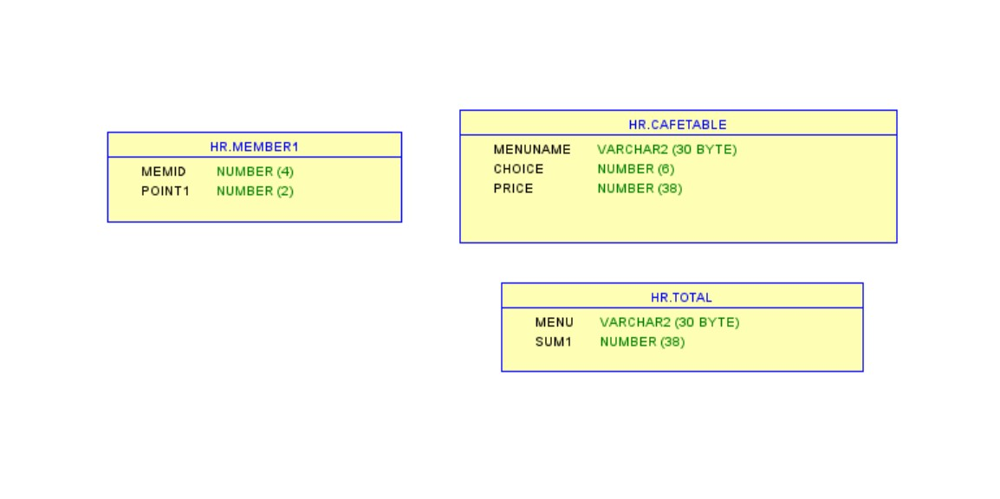
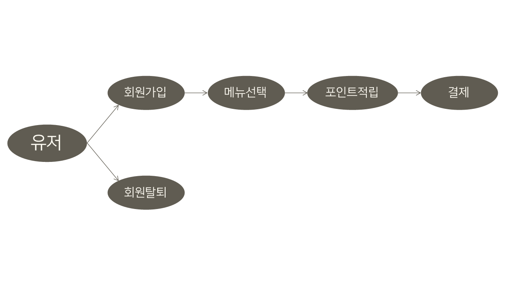
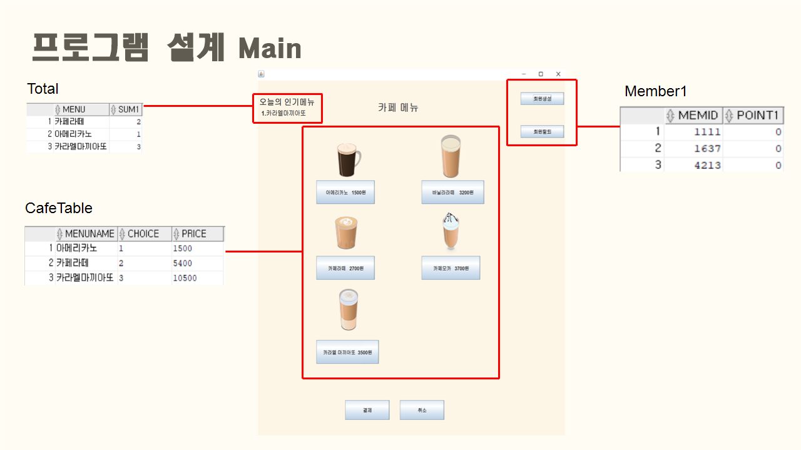
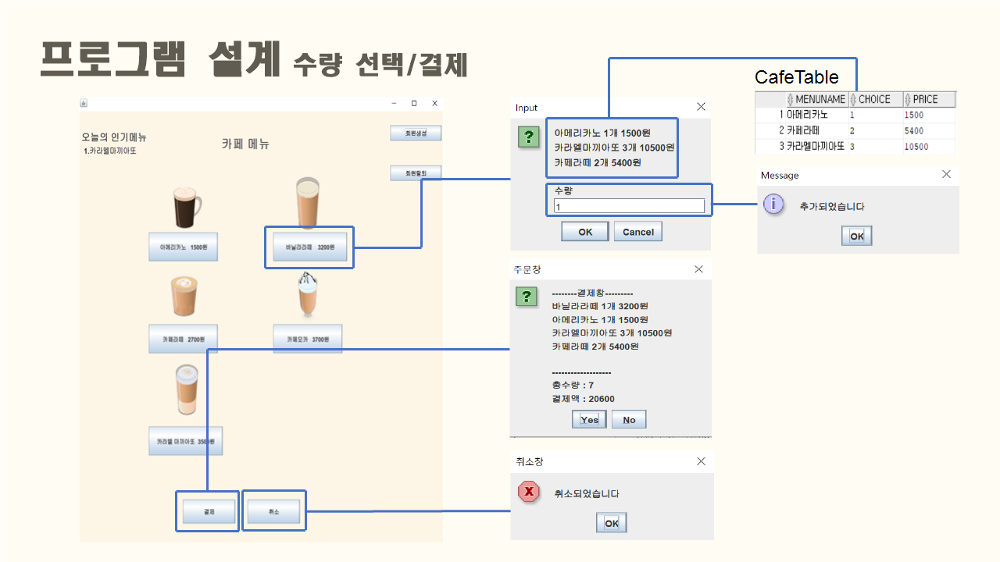
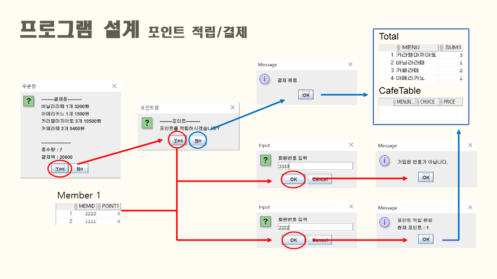

## :pushpin: cafesmartorder
>카페 스마트 오더 프로그램 

 

### 1.제작기간&참여 인원
* 2022.9.13. ~ 2022.9.19.   
* 팀프로젝트(3인)

 

### 2.사용기술
* JAVA11   
* ORACLE

 

### 3.ERD

 

### 4.핵심기능

>Client ( 회원가입 및 탈퇴, 장바구니, 주문, 포인트 적립, 인기메뉴 확인 )   
- 메뉴를 조회할 수 있다.
- 원하는 메뉴를 담을 수 있다.
- 담은 메뉴들을 결제할 수 있다.
- 포인트를 적립하고 5개가 모일 시 아메리카노 무료 쿠폰을 받을 수 있다.
- 매출 기반 인기 메뉴를 확인할 수 있다.
- 회원 가입 및 탈퇴를 할 수 있다.

상세설명

 

#### 4-1. 전체흐름

 
 

#### 4-2. Connection ✔️ [코드확인](https://github.com/jin4618/cafesmartorder/blob/4ce1b1a21be77d43740bc542db8b9ff976e21174/src/connection/Connection1.java#L3-L23)
-	JDBC를 활용한 OracleDB 연결

 

#### 4-3. 메인 화면

 
-	오늘의 인기메뉴 
=> 결제할 때마다 주문 내역을 DB에 ‘total’ 테이블에 메뉴와 수량을 저장하여 가장 많이 팔린 메뉴 출력 ✔️ [코드확인](https://github.com/jin4618/cafesmartorder/blob/5269d643895da782c0d9a238d979522fe9938847/src/total/TotalDAO.java#L41-L64)

 
-	회원생성 버튼 
-	메뉴 버튼 
-	결제 버튼 
-	취소 버튼 (추가한 메뉴들 초기화) 
-	회원 탈퇴 버튼 

 

#### 4-4. 회원가입 및 탈퇴

 
- 가입 번호(핸드폰 번호 뒤 4자리) 입력 => DB에서 'member1' 테이블에 insert ✔️ [코드확인](https://github.com/jin4618/cafesmartorder/blob/77eb38e12f8fdd77cdf12e8586e39f07396a9116/src/member/MemberDAO.java#L20-L35)
 
- 회원 번호(핸드폰 번호 뒤 4자리) 입력 => DB에서 'member1' 테이블에서 데이터를 조회하여 delete ✔️ [코드확인](https://github.com/jin4618/cafesmartorder/blob/77eb38e12f8fdd77cdf12e8586e39f07396a9116/src/member/MemberDAO.java#L37-L52)
 

#### 4-5. 주문

 
-	수량 입력 
-	메뉴 추가할 때마다 추가한 메뉴, 수량 및 가격 출력 => DB에서 ‘CafeTable’ 테이블에 저장 ✔️ [코드확인]()  
 

#### 4-6. 포인트 적립 및 결제

 
- 총 주문 내역 출력 -> DB에 ‘CafeTable’ 테이블에서 데이터를 조회하여 불러옴 ✔️ [코드확인]()  
-	Yes 버튼 누를 시 포인트 적립 창으로 이동 
- 포인트 적립을 원할 경우 회원 번호를 입력 받아 적립 
=> DB에 'member1' 테이블에서 데이터를 조회하고 회원번호가 맞는지 확인 ✔️ [코드확인]()  
=> 현재 포인트 내역 출력 / 5개 모일 시 아메리카노 쿠폰 증정 (포인트 초기화) ✔️ [코드확인]()  
- 적립을 원하지 않을 경우 결제만 진행 
 

#### 4-7. 유효성 검사 ✔️ [코드확인]() 

 
- 입력 받아야 하는 Data Type이 맞지 않을 경우 다시 입력 받음
 

 

### 5. 느낀점

