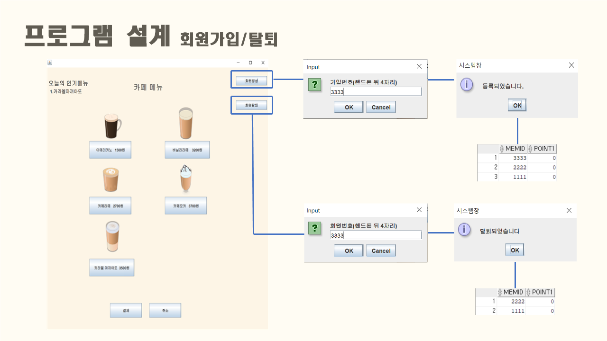
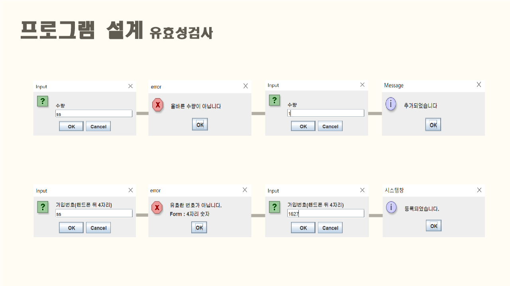

## :pushpin: cafesmartorder
>카페 스마트 오더 프로그램 

 

### 1.제작기간&참여 인원
* 2022.9.13. ~ 2022.9.19.   
* 팀프로젝트(3인)

 

### 2.사용기술
* JAVA11   
* ORACLE

 

### 3.ERD

 

### 4.핵심기능

>Client ( 회원가입 및 탈퇴, 장바구니, 주문, 포인트 적립, 인기메뉴 확인 )   
- 메뉴를 조회할 수 있다.
- 원하는 메뉴를 담을 수 있다.
- 담은 메뉴들을 결제할 수 있다.
- 포인트를 적립하고 5개가 모일 시 아메리카노 무료 쿠폰을 받을 수 있다.
- 매출 기반 인기 메뉴를 확인할 수 있다.
- 회원 가입 및 탈퇴를 할 수 있다.

상세설명

 

4-1. 전체흐름
 

 
 

4-2. Connection :pushpin: [코드확인]()
- JDBC를 활용한 OracleDB 연결
 
 

4-3. 메인 화면
 

 
 

4-4. 회원가입 및 탈퇴
 

 
 

4-5. 주문
 

 
 

4-6. 포인트 적립 및 결제
 

 
 

4-7. 유효성 검사
 

 
 

 

### 5.핵심 트러블 슈팅

 

### 6. 느낀점

